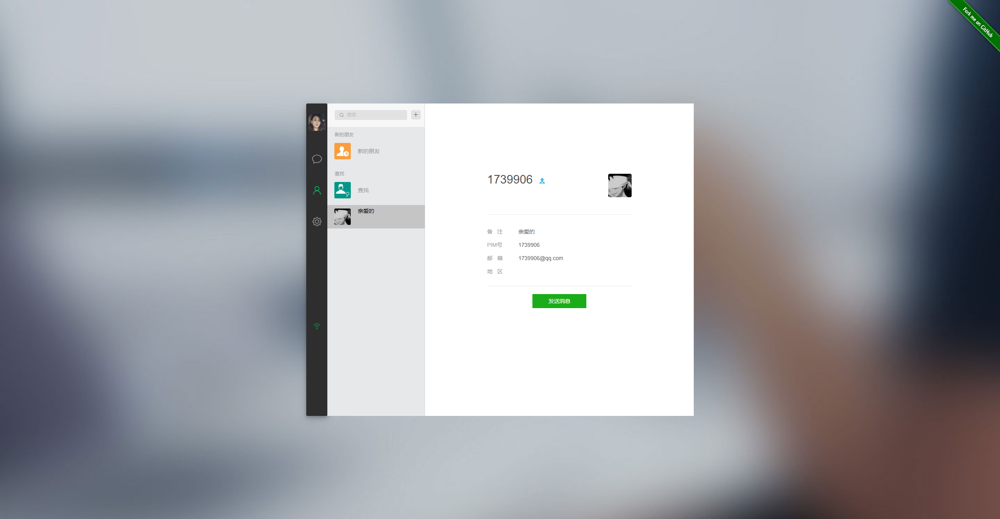
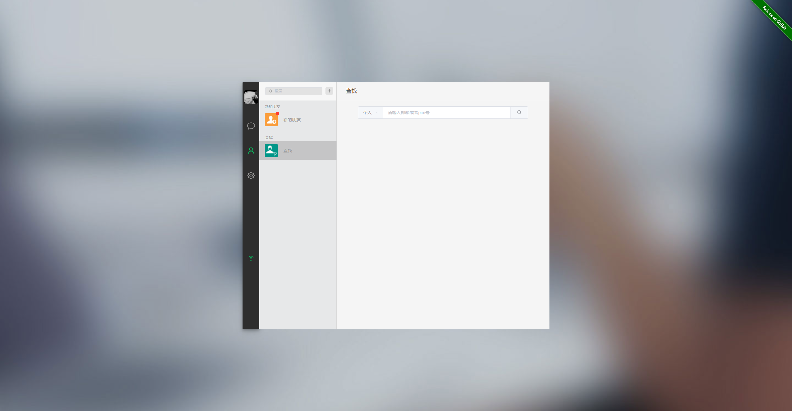
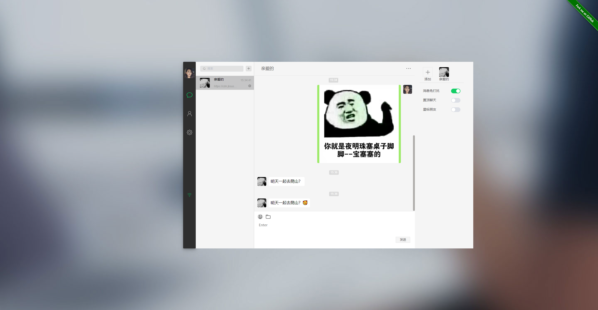
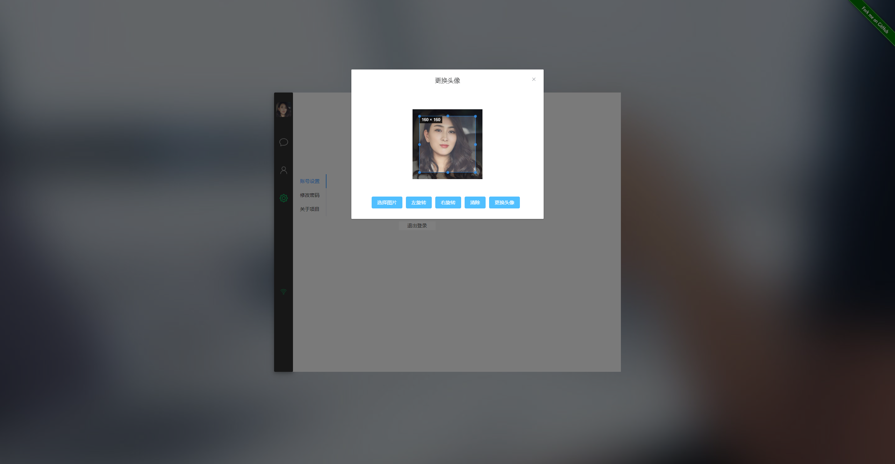

[comment]: <> ([English]&#40;./README.md&#41; | 中文)
<p align="center"><a href="https://jksusu.cn" target="_blank" rel="noopener noreferrer"></a></p>

# pim-service

> 后端基于 hyperf2.2* swoole4.6*

<a href='http://jksusu.cn/passport/login' target="_blank">点我在线体验</a>

## 快速开始

[comment]: <> (### 运行完整的pim系统)

[comment]: <> (```bash)

[comment]: <> (docker-compose 方式运行)

[comment]: <> (1. docker-compose  -v         检查环境)

[comment]: <> (2. docker-compose  up         启动系统)

[comment]: <> (3. 创建数据库im导入 pim.sql文件  访问80端口)

[comment]: <> (```)

[comment]: <> (```bash)

[comment]: <> (下载源代码运行)

[comment]: <> (1. git clone https://github.com/pim-cloud/pim-service.git 下载后端代码)

[comment]: <> (2. composer install                                       安装依赖)

[comment]: <> (3. php bin/hyperf.php start                               启动后端服务&#40;需要自己配置mysql,redis&#41;)

[comment]: <> (4. https://github.com/pim-cloud/pim-web.git               下载前端代码)

[comment]: <> (5. npm install                                            安装依赖)

[comment]: <> (6. npm run serve                                          启动（需要配置后端http，websocket地址）)

[comment]: <> (```)

[comment]: <> (### 下载最新的 pim-service 后端代码)

[comment]: <> (```bash)

[comment]: <> (git clone https://github.com/pim-cloud/pim-service.git)

[comment]: <> (```)

[comment]: <> (### 镜像维护地址)

[comment]: <> (```)

[comment]: <> (docker pull jksusu/pim-service  后端镜像下载  )

[comment]: <> (docker pull jksusu/pim-web      前端镜像下载 )

[comment]: <> (docker pull mysql:5.7.29        mysql镜像下载)

[comment]: <> (docker pull redis:6.0.6         redis镜像下载)

[comment]: <> (```)
### 项目说明
> 此项目目前仅供学习使用，web 和 php后端实现异常简陋，作者写这个项目仅仅是为了学习一下vue 以及目前前端工具。
### 技术实现
> php mysql redis vue3*

### 本地运行
```md
* 配置php node vite环境
* 运行php后端,参考hyperf教程
* node run dev 运行vue
```

### 后续计划
> 重新设计后端，实现分布式部署。坚持使用php+redis来构建一个可靠，适用于中小公司的im服务。
> 服务器已买3年，至少会在这三年内一直更新，维护，也欢迎有兴趣的小伙伴一起来。

### 项目部分内容







### 开源协议

> pim-web 是一个基于 Apache2.0 协议 开源的软件。
